# Algorithm Decision Interaction Graph

> A visual and structured record of the algorithm decisions, changes, bug discoveries, and causal interactions across all chemrust-scf phases (May 19–23, 2026), including cross-project dependencies on chemrust-hamiltonian.

```mermaid
flowchart TB
    %% ========================================================================
    %% LANE 1: chemrust-hamiltonian (upstream)
    %% ========================================================================
    subgraph HAM["chemrust-hamiltonian (upstream, validated vs CASTEP)"]
        direction TB
        H1("VEffBuilder\n(CPU, rustfft)")
        H2("RealGrid / RecipGrid\nlayout-correct types")
        H3("PseudopotentialSet\n(.usp + .recpot parser)")
        H4("NL potential\n(β-projector gemm)")
        H5("Augmentation charges\nQ_I_nm(G), screened-D")
        H6("XC kernels\n(native PBE, no libxc)")
    end

    %% ========================================================================
    %% LANE 2: Architecture & Safety
    %% ========================================================================
    subgraph ARCH["ARCHITECTURE &amp; SAFETY"]
        direction TB

        D1("Type-state SCF backbone\nADR-0001: ScfIteration<S,State>\n6 phase markers\ncompiler-enforced transitions")
        style D1 stroke-width:3px

        D1a("bon builder pattern\n9-field construction\nCheckOutcome enum")
        D1b("SpinPolicy generic\nKPoint, Smearing generic")
        D1c("pub(crate) visibility\nlocked before physics code")

        D2("Diagonalize-first\nrisk-weighted ordering\nhighest project risk first")
        style D2 stroke-width:3px

        D3("Skip linear mixing\nPulay/DIIS directly\nmetals won't converge\nwith linear mixing")
        style D3 stroke-width:2px

        D4("VEffBuilder stays CPU\nPhase 2 barrier:\nrustfft dependency\n(GPU port deferred)")
        style D4 stroke-width:2px

        D5("Native PBE XC\n(not libxc)\nhand-ported from CASTEP")
        style D5 stroke-width:2px

        D6("R-ChFSI adopted\nDas et al. (2025) Alg 3\nresidual-based filter\ntolerates inexact S⁻¹")
        style D6 stroke-width:2px

        D7("Global Woodbury S⁻¹\nexact inverse over\nper-ion approximation\nLU + full complex B^H-B")
        style D7 stroke-width:3px

        D8("Filter Mode Gate\nMode A (BareH) fails\nMode B (SinvHKeepHEig) wins\nMode C (SinvHKeepSinvEig) fails")
        style D8 stroke-width:2px

        A1("❌ Runtime enum guards\n(rejected: 8 bug categories\nfrom CASTEP crash logs)")
        style A1 stroke-dasharray:5 5,fill:white

        A2("❌ CPU-first prototype\n(rejected: doubled work\nwithout risk reduction)")
        style A2 stroke-dasharray:5 5,fill:white

        A3("❌ Linear mixing\n(rejected: won't converge\nfor Cu111_CO metal)")
        style A3 stroke-dasharray:5 5,fill:white

        A4("❌ gpufft crate\n(rejected: batch=1\nblocks cufftPlanMany)")
        style A4 stroke-dasharray:5 5,fill:white

        A5("❌ libxc dependency\n(rejected: XC already\nhand-ported, not bottleneck)")
        style A5 stroke-dasharray:5 5,fill:white

        A6("❌ Cholesky for M\n(rejected: M not SPD;\nzpotrf info=2)")
        style A6 stroke-dasharray:5 5,fill:white

        A7("❌ Per-ion Woodbury\n(rejected: 1.4% error →\nstandard ChFSI stagnation)")
        style A7 stroke-dasharray:5 5,fill:white

        A8("❌ Bare-H ChFSI\n(rejected: filters wrong\neigenspectrum when S≠I)")
        style A8 stroke-dasharray:5 5,fill:white
    end

    %% ========================================================================
    %% LANE 3: GPU platform
    %% ========================================================================
    subgraph GPU["GPU PLATFORM"]
        direction TB

        G1("GPU-direct decision\ncudarc v0.19.7\nCUDA 12.9 (cc 6.1)\nraw cuFFT/cuBLAS/cuSOLVER")
        style G1 stroke-width:3px

        G2("PcieAccount\nADR-0002\nH2D/D2H byte tracking\n#[must_use] + assert_eq!")

        G3("cuFFT batched plans\ncufftPlanMany for density\ncuBLAS Zgemm/Zdotc\ncuSOLVER ZHEGVD + ZGETRF/ZGETRS")

        G4("NVRTC runtime-compiled kernels\ntranspose, band_scale_axpy\naccumulate_density, Gram-Schmidt")

        G5("GPU QSfCache\n(perf opt, deferred)\ngeometry-static Q·SF\nper-ion on GPU")
    end

    %% ========================================================================
    %% LANE 4: Eigensolver
    %% ========================================================================
    subgraph EIG["EIGENSOLVER"]
        direction TB

        E1("Standard ChFSI\nChebyshev polynomial filter\ndegree=8, Gram-Schmidt ON\nRayleigh-Ritz (ZHEGVD)\nb_low per Zhou (2014)")
        style E1 fill:#90EE90

        E2("Lanczos upper-bound estimator\nL2-Lanczos on bare H\nT_k tridiagonal → λ_max\nGershgorin fallback cap")
        style E2 fill:#90EE90

        E3("R-ChFSI recurrence\nY = H·X − S·X·Λ (residual)\nfilter on R_Y, not X\nerror ∝ ‖R_Y‖ → 0")
        style E3 fill:#FFD700

        E4("Bare-H R-ChFSI experiment\nS⁻¹ removed from recurrence\nkept in Lanczos only\nH-spectrum framing")
        style E4 fill:#FFD700

        E5("Mode B: SinvHKeepHEig\nS⁻¹-H in Chebyshev recurrence\nH-eigenvalues in Λ\nno S⁻¹ in reconstruction")
        style E5 fill:#90EE90,font-weight:bold,stroke-width:2px

        E6("iter-1 CORRECT\nall 10 bands within\n0.05 Ha of CASTEP\n|Δ|max = 0.029 Ha")
        style E6 fill:#90EE90,stroke-width:3px

        E7("iter-2 DIVERGES\nband-0: −0.864 Ha (ref −1.055)\nlast band: 1.952 Ha (ref 0.115)\nV_eff range: 20.26 Ha (ref 8.69)\ntwo deviations from Das(2025) Alg 3")
        style E7 fill:#FF6B6B,stroke-width:3px
    end

    %% ========================================================================
    %% LANE 5: Density & Mixing
    %% ========================================================================
    subgraph DEN["DENSITY &amp; MIXING"]
        direction TB

        M1("GPU density construction\nsmooth ρ_PW channel\nconstruct_density_gpu\nraw ρ×Ω convention")
        style M1 fill:#90EE90

        M2("ADR-0003: Two-Channel Architecture\nρ_PW (wave grid) + ρ_aug (fine grid)\nseparate channels, different conventions\nQSfCache geometry-static")
        style M2 fill:#90EE90,stroke-width:2px

        M3("USPP augmentation density\ncompute_aug_density_fine\nβ projections → ω_I_nm matrix\nQ_I_nm(G)-exp(−iG·R_I)")
        style M3 fill:#90EE90

        M4("DIIS + Kerker mixing\nCASTEP-matched protocol\ntotal energy tracking\nPulay history=8, Kerker A=1.5")
        style M4 fill:#90EE90

        M5("Density code verified\nsame-input vs CASTEP F8\nsoft: 1.000000, aug: 1.000084\ntotal: 1.000053")
        style M5 fill:#90EE90,stroke-width:2px

        M6("CPU bottleneck (~500s/iter)\nprecompute_q_on_grid (radial)\napply_q_and_sf (per-ion grid walk)\nGPU QSfCache deferred")
        style M6 fill:#FFD700
    end

    %% ========================================================================
    %% LANE 6: Bug Discoveries + Corrections
    %% ========================================================================
    subgraph BUG["BUG DISCOVERIES &amp; CORRECTIONS"]
        direction TB

        B1("cuFFT dim ordering\n+ RR transpose layout\nTWO INDEPENDENT BUGS\npartially cancelled")
        style B1 fill:#FF6B6B

        B1a("DONT-REVERT pattern\nfixing one bug made result\nworse → hunt for second bug\nisolated diagnostic anchored fix")
        style B1a fill:#FFD700

        B2("GPU D-screening silent regression\ncorrect for origin ion (0,0,0)\nWRONG for all other 17 ions\nd_screened 10-50× too large")
        style B2 fill:#FF6B6B

        B3("Range-only acceptance gap\nANCHOR-WEAK-DISCRIMINATOR\nV_eff range passes but\npointwise at ion cores fails")
        style B3 fill:#FF6B6B

        B4("Density normalization misattribution\ncomparing different SCF states\nsame-input check proved\ndensity code correct")
        style B4 fill:#FF6B6B

        B5("Augmentation density missing\niter-2 ρ_PW only (no ρ_aug)\nV_eff collapses to bare V_loc\n→ Lanczos detects corrupted H")
        style B5 fill:#FF6B6B

        B6("S⁻¹ missing in Chebyshev filter\nbare H recurrence for\ngeneralized eigenproblem\nfilters wrong invariant subspace")
        style B6 fill:#FF6B6B

        B7("THREE COMPOUNDING BUGS\nD-screening + b_low + filter mismatch\nMASKED EACH OTHER\nfixing any one made it worse")
        style B7 fill:#FF6B6B,stroke-width:3px

        B7a("b_low bootstrap: max_veff+2.0\n→ max_veff (Zhou 2014)\nfilter cutoff above all bands")
        style B7a fill:#FFD700

        B7b("Filter operator mismatch\nbare H recurrence vs\nS⁻¹-H Lanczos bounds\n→ Mode B (SinvHKeepHEig)")
        style B7b fill:#FFD700

        B8("Current: iter-2 diverges\nper-band code branches when\neigenvalues=Some(...)\nGRID-SHAPED vs VECTOR-SHAPED\nρ mixing suspected")
        style B8 fill:#FF6B6B,stroke-width:3px
    end

    %% ========================================================================
    %% EDGES: Cross-project dependencies
    %% ========================================================================
    H1 -->|"provides\nVEff assembly"| M1
    H2 -->|"layout types\nfor FFT safety"| G3
    H3 -->|"parses\npseudopotentials"| E1
    H4 -->|"NL apply\nkernel"| E1
    H5 -->|"aug charges\n+ screening"| M3
    H6 -->|"XC kernel\ncallbacks"| M2

    %% ========================================================================
    %% EDGES: Architecture → platform
    %% ========================================================================
    D1 -->|"enables safe\ntransitions"| G1
    D2 -->|"drives priority"| G1
    D2 -->|"drives priority"| E1
    G1 -->|"constrains\nwrapper choice"| G3
    G1 -->|"constrains\nkernel language"| G4
    G1 -->|"enables\ntracking"| G2

    %% ========================================================================
    %% EDGES: Platform → Eigensolver
    %% ========================================================================
    G3 -->|"cuBLAS/ZHEGVD"| E1
    G4 -->|"NVRTC kernels"| E1
    G2 -->|"tracks transfer\nin diagonalize"| E1
    G3 -->|"cuSOLVER LU"| D7

    %% ========================================================================
    %% EDGES: Eigensolver → Density
    %% ========================================================================
    E1 -->|"produces ψ, ε"| M1
    E6 -->|"iter-1 ψ feeds"| M5

    %% ========================================================================
    %% EDGES: Architecture → algorithm
    %% ========================================================================
    D6 -->|"implements"| E3
    D8 -->|"selects"| E5
    D7 -->|"provides\nexact S⁻¹"| E5

    %% ========================================================================
    %% EDGES: Algorithm evolution
    %% ========================================================================
    E1 -->|"base algorithm"| E3
    E3 -->|"experiment:\nremove S⁻¹"| E4
    D7 -->|"exact S⁻¹ makes\nR-ChFSI ≡ ChFSI"| E5
    E4 -->|"converges to"| E5
    E5 -->|"produces"| E6
    E6 -->|"feeds into"| E7

    %% ========================================================================
    %% EDGES: Density pipeline
    %% ========================================================================
    M1 -->|"needs aug"| M3
    M2 -->|"enforces sep"| M3
    M3 -->|"enables correct\niter-2 V_eff"| M5
    M1 -->|"feeds"| M4
    M3 -->|"feeds"| M4
    M5 -->|"bottleneck"| M6

    %% ========================================================================
    %% EDGES: Bug discoveries → Corrections
    %% ========================================================================
    B1 -->|"diagnostic\nanchoring"| B1a
    B2 -->|"reverted GPU→CPU;\nenable non-trivial test"| M3
    B3 -->|"changed criteria\nto pointwise"| M5
    B4 -->|"same-input check\nproved density correct"| M5
    B5 -->|"required ρ_aug\nimplementation"| M3
    B6 -->|"required S⁻¹ in\nfilter recurrence"| D6

    %% ========================================================================
    %% EDGES: Three compounding bugs
    %% ========================================================================
    B2 -->|"masked"| B7
    B7a -->|"masked"| B7
    B7b -->|"masked"| B7
    B7 -->|"all three fixed\ncommit 8607def"| E6
    B2 -->|"fixed: revert\nto CPU"| B7a
    B7a -->|"fixed: max_veff\n(Zhou 2014)"| E5
    B7b -->|"fixed: Mode B\ndefault"| E5

    %% ========================================================================
    %% EDGES: Current state
    %% ========================================================================
    E6 -->|"iter-2 diverges\ndespite iter-1 OK"| B8
    B8 -->|"suspected:\neigenvalues=Some\nper-band branches"| E7

    %% ========================================================================
    %% EDGES: Rejected alternatives
    %% ========================================================================
    A1 -.->|"rejected for"| D1
    A2 -.->|"rejected for"| G1
    A3 -.->|"rejected for"| D3
    A4 -.->|"rejected for"| G1
    A5 -.->|"rejected for"| D5
    A6 -.->|"rejected for"| D7
    A7 -.->|"rejected for"| D7
    A8 -.->|"rejected for"| E5

    %% ========================================================================
    %% EDGES: Upstream→Woodbury
    %% ========================================================================
    H5 -->|"zero Q⁻¹ rows\n→ M near-singular\ndrives LU choice"| D7
```



---

## Causal Chain Explanations

### 1. Foundational Chain: Architecture → GPU Platform → All Downstream

```
Type-state SCF  ──enables──▶  GPU-direct decision  ──constrains──▶  cudarc/cuFFT/cuSOLVER
                                                                          │
                                                    ┌─────────────────────┤
                                                    ▼                     ▼
                                             NVRTC kernels        cuSOLVER ZGETRF
                                                                         │
                                                                    Global Woodbury
```

**Why it matters:** One decision at the very top of the graph constrained every GPU implementation detail days later. The type-state pattern (`ScfIteration<State>`) makes phase transitions compile-checked, so GPU buffer ownership, synchronization, and transfer accounting are all enforced by the compiler. The GPU-direct choice (skip CPU prototype) maximized risk exposure but also maximized learning — the most critical bugs were GPU-specific silent correctness regressions (D-screening, cuFFT layout) that a CPU prototype would have masked.

**Commits:** `efc7a4c` (type-state SCF), `4382cb4` (cudarc + CUDA 12.9), `26c9b10` (cuFFT/cuBLAS/cuSOLVER wrappers)

---

### 2. The Compounding-Bug Cluster (Central Story)

```
GPU D-screening silent regression  ──masked──▶
b_low bootstrap (max_veff+2.0)     ──masked──▶  THREE COMPOUNDING BUGS  ──all fixed in 8607def──▶  iter-1 correct
Filter operator mismatch (bare H)  ──masked──▶
```

**Why it matters:** Three independent bugs that each individually produced wrong eigenvalues, but happened to partially cancel when all three were present. Fixing any one unmasked the others, making results worse. This is the exact scenario that created the DONT-REVERT pattern (B1a): when a fix verified by an isolated diagnostic test makes end-to-end results worse, the correct response is not to revert but to keep the fix and hunt for the next compounding bug.

Each bug's effect:
- **D-screening:** `d_screened` was 10–50× too large for non-origin ions (Cu111_CO has 18 ions), corrupting the Hamiltonian for 17/18 of them. The origin ion (tested in isolation) was perfectly correct.
- **b_low bootstrap:** `max_veff + 2.0 = 2.09 Ha` placed the Chebyshev filter cutoff above all tracked bands, making the filter non-selective (uniform amplification with no discrimination).
- **Filter operator mismatch:** Bare H recurrence combined with S⁻¹·H Lanczos bounds meant the filter window and the operator being filtered had different spectral distributions.

The key lesson: **revert, but only a compounding revert** — the correct decision was `8607def` which fixed all three simultaneously, not `dont-revert` applied to each fix individually.

**Commits:** `8607def` (three-bug fix), `1fa3067` (debug session recording), `b7 s in open-followups.md §10

---

### 3. S⁻¹ Evolution: From Per-Ion Approximation to Exact Global Woodbury

```
Per-ion Woodbury (1.4% error)
    │
    ▼
R-ChFSI adopted (tolerates inexact S⁻¹)
    │
    ▼
m_inv → s_inv typo discovered
    │
    ▼
Global Woodbury (exact, 3.8e-15 identity test)
    │
    ▼ (exact S⁻¹ makes)
R-ChFSI ≡ standard ChFSI (Das 2025, main.tex:612)
    │
    ▼
Mode B filter: S⁻¹·H in recurrence, H-eig in Λ
    │
    ▼
iter-1 correct (all 10 bands ≤ 0.05 Ha of CASTEP)
```

**Why it matters:** The initial bet on R-ChFSI was motivated by a tolerance for inexact S⁻¹ — Algorithm 3 from Das et al. (2025) explicitly handles this case. But the per-ion Woodbury approximation turned out to have a 1.4% error that caused stagnation in standard ChFSI. The m_inv → s_inv typo (Gauss-Jordan identity was uploaded instead of the true inverse) further compounded the unreliability.

The Global Woodbury implementation brought accuracy to machine epsilon (`||S⁻¹·S·ψ − ψ||_∞ = 3.8e-15`), which made the theoretical argument for R-ChFSI over standard ChFSI moot. However, the R-ChFSI infrastructure proved valuable for the filter-mode gate experiment (Bare-H vs SinvHKeepHEig vs SinvHKeepSinvEig), giving the project three modes to test on the same code path.

**Commits:** `1553401` (wire S⁻¹ into Chebyshev), `c522743` (Woodbury diagnostic), `4a6e093` (Global Woodbury precompute), `c70a3ed` (apply_s_inverse), `055149b` (Cholesky → LU), `986bc96` (full complex B^H·B)

---

### 4. Bug-to-Fix Cascade: How Discoveries Shaped Algorithm Choices

```
Bug discovery        │  Empirical finding           │  Algorithm consequence
──────────────────────┼──────────────────────────────┼────────────────────────────────
cuFFT + RR layout    │  Two bugs partially cancel   │  DONT-REVERT pattern documented
GPU D-screening      │  Origin-only test misses     │  GPU → CPU revert; non-trivial GPU tests
Range-only checks    │  V_eff range passes but      │  Pointwise acceptance at ion centers
                     │  ion cores corrupted         │
Density comparison   │  Different SCF states        │  Same-input controlled experiment
                     │  ≠ code bug                  │  requirement
Missing ρ_aug        │  iter-2 V_eff collapses      │  Augmentation density wiring
S⁻¹ missing in       │  Bare H filters wrong        │  Mode B filter (SinvHKeepHEig)
filter recurrence    │  subspace for S≠I            │
```

**Why it matters:** Every bug discovery invalidated a prior assumption and forced a corrective algorithm choice. The graph makes visible that the project iterated on its test methodology as much as its algorithm implementation — each bug revealed a blind spot in the testing approach (origin-only, range-only, cross-state comparison). The arrow from "Range-only acceptance gap" to "Density code verified" shows how test methodology improvements propagated across components.

---

### 5. Current Active Cluster: iter-2 Divergence

```
iter-1 CORRECT ──feeds──▶  iter-2 DIVERGES
                                │
                                ▼ suspected
                    eigenvalues=Some(...) in Chebyshev recurrence
                    → per-band code branches (iter-1 path was eigs=None)
                    → GRID-SHAPED vs VECTOR-SHAPED density mixing inconsistency?
```

**Status: UNRESOLVED** — this is where the graph ends, with the SCF divergence at iter-2 being the active problem. The downstream pipeline (RR, S_sub, ZHEGVD, density) has been proven correct via the ndeg=0 baseline test. The bug is inside the Chebyshev filter recurrence body (`chebyshev.rs:1451-1697`) specifically in the code path activated by `eigenvalues=Some(...)`.

Two deviations from Das et al. (2025) Algorithm 3 are the primary suspects:
1. **Step 3 operator order:** Rust impl = `S⁻¹·(H·R_Y)`, Das = `H·(S⁻¹·R_Y)` — order matters when S and H don't commute
2. **Step 4 reconstruction in Mode B:** omits `S⁻¹·D⁻¹·R_Y` term — does this break the invariant subspace in subsequent iterations?

**Current debug session:** `notes/debug/debug-20260523-1149-iter2-divergence/`
**Open follow-up:** `notes/open-followups.md §11`

---

## Visual Legend

| Style | Meaning |
|-------|---------|
| Solid rectangle, heavy border (3px) | Foundational decision — many downstream consequences |
| Solid rectangle, normal border | Implemented node — algorithm or component |
| Dashed border (stroke-dasharray:5 5) | Rejected alternative — considered and explicitly discarded |
| Fill: `#90EE90` (green) | Verified correct — meets CASTEP reference |
| Fill: `#FFD700` (yellow) | Experimental, unstable, or performance-bottleneck |
| Fill: `#FF6B6B` (red) | Bug, divergence, or unresolved issue |
| Edge label | Relationship type: enables / constrains / provides / drives / masked / corrects / rejected-for |

## References

- **Open followups:** `notes/open-followups.md` (11 issues, §10 = Woodbury resolution, §11 = iter-2 divergence)
- **Failure patterns:** `notes/failure-patterns.md` (7 patterns including DONT-REVERT, range-only gap, density misattribution)
- **Debug sessions:** `notes/debug/` (8 sessions, latest: `debug-20260523-1149-iter2-divergence`)
- **ADRs:** `docs/adr/` (0001 = type-state, 0002 = PcieAccount, 0003 = two-channel density)
- **DECISIONS.md:** project root (LU over Cholesky, full complex B^H·B)
- **Upstream crate:** `~/programming/chemrust-hamiltonian/` (validated physics engine)
